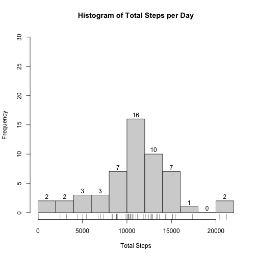
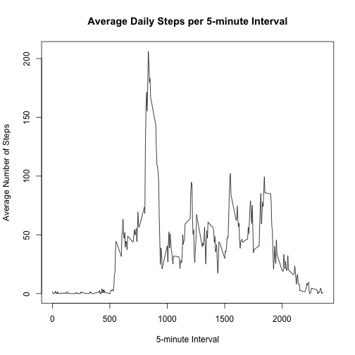
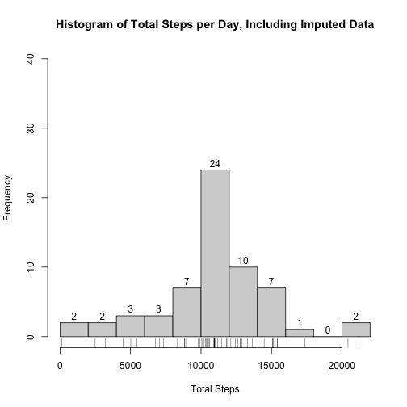
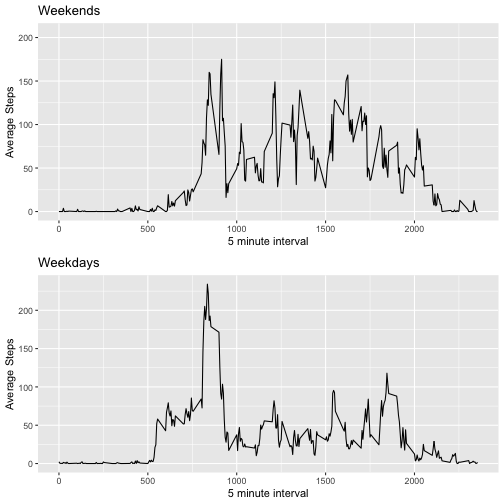

## Loading and preprocessing the data

We can unzip and read the CSV file. The `date` column within the data set can be
converted to an actual `Date` object from its `chr` format.


```r
activity <- read.csv(file = unz("activity.zip", "activity.csv"))
activity$date <- as.Date(activity$date, "%Y-%m-%d")
summary(activity)
```

```
##      steps             date               interval     
##  Min.   :  0.00   Min.   :2012-10-01   Min.   :   0.0  
##  1st Qu.:  0.00   1st Qu.:2012-10-16   1st Qu.: 588.8  
##  Median :  0.00   Median :2012-10-31   Median :1177.5  
##  Mean   : 37.38   Mean   :2012-10-31   Mean   :1177.5  
##  3rd Qu.: 12.00   3rd Qu.:2012-11-15   3rd Qu.:1766.2  
##  Max.   :806.00   Max.   :2012-11-30   Max.   :2355.0  
##  NA's   :2304
```

## What is mean total number of steps taken per day?

First we must aggregate the total number of steps for each day.


```r
totalStepsPerDay <- aggregate(steps ~ date, activity, sum, na.rm = TRUE)
```

We can then plot a histogram of the total steps per day.


```r
h <- hist(totalStepsPerDay$steps, 
     xlab = "Total Steps", 
     main = "Histogram of Total Steps per Day",
     labels = TRUE,
     ylim = c(0, 30),
     breaks = 10)
rug(totalStepsPerDay$steps)
```



We can also calculate the mean and median steps.

Median total steps per day:

```r
medianStepsPerDay <- median(totalStepsPerDay$steps)
medianStepsPerDay
```

```
## [1] 10765
```

Mean total steps per day:

```r
meanStepsPerDay <- mean(totalStepsPerDay$steps)
meanStepsPerDay
```

```
## [1] 10766.19
```


## What is the average daily activity pattern?


```r
meanStepsPerInterval <- aggregate(steps ~ interval, activity, mean, na.rm = TRUE)
plot(meanStepsPerInterval$interval, 
     meanStepsPerInterval$steps,
     type = "l",
     xlab = "5-minute Interval", 
     ylab = "Average Number of Steps",
     main = "Average Daily Steps per 5-minute Interval")
```



The 5-minute interval with the maximum average number of steps:

```r
maximumSteps = max(meanStepsPerInterval$steps, na.rm = TRUE)
meanStepsPerInterval[meanStepsPerInterval$steps == maximumSteps,]$interval
```

```
## [1] 835
```

## Imputing missing values

Reviewing our earlier summary data, only the `steps` column contain `NA` values, 
so those are the ones we need to count. The total number of entries without 
steps is:


```r
sum(is.na(activity$steps))
```

```
## [1] 2304
```

To fill in these missing values, we could use the average steps during the same
5-minute interval period for other dates. This assumes that the amount of
activity for that interval is somewhat consistent between days. We can use a
function to locate the missing day's interval mean step data, or choose the 
overall daily mean divided to a 5-minute interval value. This value will be
rounded up to a whole step value.


```r
lookupIntervalMeanSteps <- function(interval) {
  intervalMeanSteps <- meanStepsPerInterval[meanStepsPerInterval$interval == interval,]$steps
  if_else(
    !is.na(intervalMeanSteps),
    ceiling(intervalMeanSteps),
    ceiling(meanStepsPerDay / 288)
  )
}
```


```r
require(dplyr)
completeActivity <- activity %>% mutate(steps = ifelse(
     !is.na(steps),
     steps,
     lookupIntervalMeanSteps(interval)
))
summary(completeActivity)
```

```
##      steps             date               interval     
##  Min.   :  0.00   Min.   :2012-10-01   Min.   :   0.0  
##  1st Qu.:  0.00   1st Qu.:2012-10-16   1st Qu.: 588.8  
##  Median :  0.00   Median :2012-10-31   Median :1177.5  
##  Mean   : 37.46   Mean   :2012-10-31   Mean   :1177.5  
##  3rd Qu.: 38.00   3rd Qu.:2012-11-15   3rd Qu.:1766.2  
##  Max.   :806.00   Max.   :2012-11-30   Max.   :2355.0
```
We can now plot a histogram of the filled in dataset.


```r
totalStepsPerDayComplete <- aggregate(steps ~ date, completeActivity, sum, na.rm = TRUE)
hc <- hist(totalStepsPerDayComplete$steps, 
     xlab = "Total Steps", 
     main = "Histogram of Total Steps per Day, Including Imputed Data",
     labels = TRUE,
     ylim = c(0, 40),
     breaks = 10)
rug(totalStepsPerDayComplete$steps)
```


We can now examine the mean and median steps per day for the imputed dataset.

Median total steps per day for imputed data:

```r
imputedMedianStepsPerDay <- median(totalStepsPerDayComplete$steps)
imputedMedianStepsPerDay
```

```
## [1] 10944
```

Mean total steps per day for imputed data:

```r
imputedMeanStepsPerDay <- mean(totalStepsPerDayComplete$steps)
imputedMeanStepsPerDay
```

```
## [1] 10788.93
```

Now lets compare these more closely with the previous mean/median from
data without imputed values.


```r
comparison <- data.frame("Mean Daily Steps" = c(meanStepsPerDay, imputedMeanStepsPerDay),
                         "Median Daily Steps" = c(medianStepsPerDay, imputedMeanStepsPerDay),
                         row.names = c("With NA", "Without NA"))
comparison
```

```
##            Mean.Daily.Steps Median.Daily.Steps
## With NA            10766.19           10765.00
## Without NA         10788.93           10788.93
```
The imputed values slightly raised the mean and median values. From looking
at our histograms, this appears to be from increased contributions in the 
10,000 - 12,000 daily steps range -- the mean/median step range. This makes
sense since my strategy to impute missing values was to use average steps 
for the day or interval as a replacement value.

## Are there differences in activity patterns between weekdays and weekends?

First lets add a weekday/weekend factor `pw` to the entries in the data set.


```r
require(dplyr)
weekDays <- c("Monday", "Tuesday", "Wednesday", "Thursday", "Friday", "Saturday", "Sunday")
labelValues <- c("weekday", "weekday", "weekday", "weekday", "weekday", "weekend", "weekend")
activityWithWeek <- activity %>% mutate(pw = weekdays(date))
activityWithWeek$pw <- factor(activityWithWeek$pw, levels = weekDays, labels = labelValues)
str(activityWithWeek)
```

```
## 'data.frame':	17568 obs. of  4 variables:
##  $ steps   : int  NA NA NA NA NA NA NA NA NA NA ...
##  $ date    : Date, format: "2012-10-01" "2012-10-01" "2012-10-01" ...
##  $ interval: int  0 5 10 15 20 25 30 35 40 45 ...
##  $ pw      : Factor w/ 2 levels "weekday","weekend": 1 1 1 1 1 1 1 1 1 1 ...
```
Lets get some stats on these updated values.


```r
summary(activityWithWeek)
```

```
##      steps             date               interval            pw       
##  Min.   :  0.00   Min.   :2012-10-01   Min.   :   0.0   weekday:12960  
##  1st Qu.:  0.00   1st Qu.:2012-10-16   1st Qu.: 588.8   weekend: 4608  
##  Median :  0.00   Median :2012-10-31   Median :1177.5                  
##  Mean   : 37.38   Mean   :2012-10-31   Mean   :1177.5                  
##  3rd Qu.: 12.00   3rd Qu.:2012-11-15   3rd Qu.:1766.2                  
##  Max.   :806.00   Max.   :2012-11-30   Max.   :2355.0                  
##  NA's   :2304
```
Now lets plot the average number of steps for weekdays vs weekends.


```r
require(ggplot2)
require(gridExtra)
weekdayMeanSteps <- aggregate(steps ~ interval, 
                              activityWithWeek[activityWithWeek$pw == "weekday",], 
                              mean, 
                              na.rm = TRUE)
weekdayMax <- max(weekdayMeanSteps$steps, na.rm = TRUE)
weekendMeanSteps <- aggregate(steps ~ interval, 
                              activityWithWeek[activityWithWeek$pw == "weekend",], 
                              mean, 
                              na.rm = TRUE)
weekendMax <- max(weekendMeanSteps$steps, na.rm = TRUE)
weekendPlot <- ggplot(weekendMeanSteps, 
                      aes(x=interval, y=steps)) + 
  geom_line() + 
  xlab("5 minute interval") +
  ylab("Average Steps") +
  ylim(c(0, maximumSteps)) +
  ggtitle("Weekends")
weekdayPlot <- ggplot(weekdayMeanSteps, 
                      aes(x=interval, y=steps)) + 
  geom_line() + 
  xlab("5 minute interval") +
  ylab("Average Steps") +
  ylim(c(0, max(c(weekendMax, weekdayMax)))) +
  ggtitle("Weekdays")
grid.arrange(weekendPlot, weekdayPlot, nrow=2)
```


